# BridgingTech AI Email Platform — Complete Data Model

> **Document scope:** End-to-end ER diagrams and table-by-table explanations for the entire email-system database, organized into **10 logical domains**.
> Every table has 3 things: **What** it is, **Why** it exists, and **How** the system uses it.
>
> **Target audience:** Engineers building this system at BridgingTech.
> **Storage choice:** Email-system DB is a new MySQL or PostgreSQL instance (separate from product DBs).
> **Vector store:** Qdrant (already self-hosted).

---

## Table of Contents

1. [Conventions](#conventions)
2. [Domain 1 — Identity & Access](#domain-1--identity--access)
3. [Domain 2 — Products & Brand](#domain-2--products--brand)
4. [Domain 3 — Contact Hub](#domain-3--contact-hub)
5. [Domain 4 — Templates](#domain-4--templates)
6. [Domain 5 — Conversations & Drafts](#domain-5--conversations--drafts)
7. [Domain 6 — Campaigns & Segments](#domain-6--campaigns--segments)
8. [Domain 7 — Risk & Approval](#domain-7--risk--approval)
9. [Domain 8 — Sending](#domain-8--sending)
10. [Domain 9 — Tracking & Events](#domain-9--tracking--events)
11. [Domain 10 — AI Ops, Compliance & Audit](#domain-10--ai-ops-compliance--audit)
12. [Cross-Domain Relationships](#cross-domain-relationships)
13. [Indexing & Performance Notes](#indexing--performance-notes)
14. [Setup Order](#setup-order)

---

## Conventions

| Convention | Standard |
|---|---|
| Primary key | `id` (UUID v4, never auto-increment) |
| Timestamps | `created_at`, `updated_at`, `deleted_at` (soft delete) — all UTC |
| Foreign keys | `<table_singular>_id` (e.g., `user_id`, `product_id`) |
| Enums | Stored as `VARCHAR` with a CHECK constraint (portable across MySQL/PG) |
| JSON columns | Stored as `JSON` type (MySQL 5.7+, PG native) |
| Encrypted columns | Suffix `_encrypted` — AES-256-GCM, key from KMS |
| Money | Stored as `DECIMAL(12,4)` (4 decimals for fractional cents in LLM costs) |
| Booleans | Default to `FALSE`, never `NULL` |

All tables include `created_at`, `updated_at` (and `deleted_at` where applicable) — these are omitted from per-table specs to reduce noise.

---

## Domain 1 — Identity & Access

**Purpose:** Manage BridgingTech employees, teams, and what they're allowed to do.
**Key question this domain answers:** *"Can this user send a Denefits email and approve a Recuvery email?"*

### ER Diagram

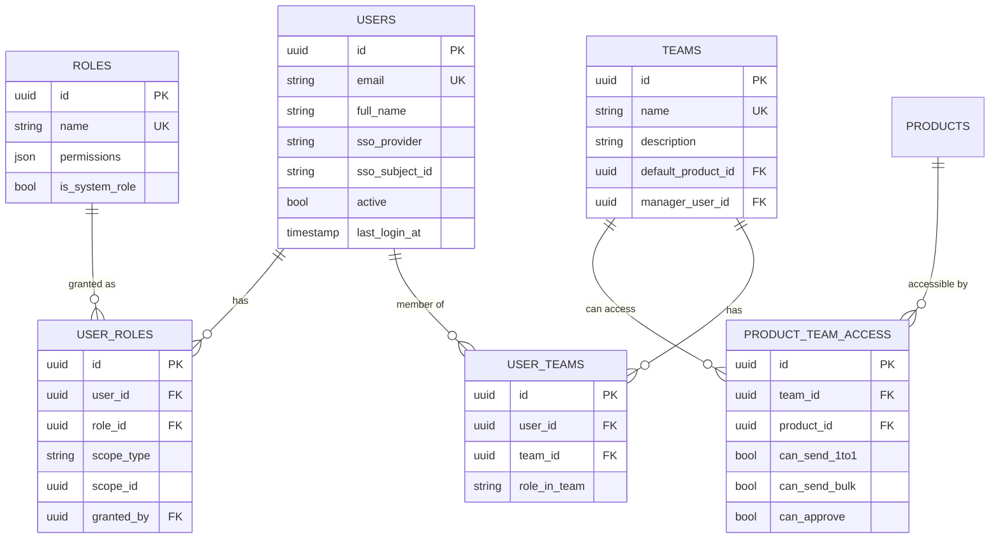

### Tables

#### `users`
- **What:** BridgingTech employees authorized to use the platform.
- **Why:** Every action in the system attributes to a user (audit, approval routing, sending-from identity).
- **How:** Auto-provisioned via SSO (Google Workspace + Azure AD). On first login, a user row is created (JIT). The `sso_provider` + `sso_subject_id` pair is the identity anchor.

#### `teams`
- **What:** Departments/groups (e.g., "Denefits Sales", "Practina Marketing", "Recuvery Collections").
- **Why:** Used to (a) suggest default product context, (b) route approvals to a team's manager, (c) grant product access in bulk.
- **How:** Admin creates teams via admin panel. Each team has a `default_product_id` so a Denefits Sales rep auto-defaults to Denefits when composing.

#### `user_teams`
- **What:** Many-to-many join — a user can belong to multiple teams.
- **Why:** Real life: someone might be in "Denefits Sales" + "Cross-Product Marketing".
- **How:** Admin assigns. `role_in_team` distinguishes "member" vs "lead" vs "approver".

#### `roles`
- **What:** System roles: `admin`, `manager`, `approver`, `sender`, `viewer`.
- **Why:** RBAC — different permissions for different jobs.
- **How:** Seeded at install. `permissions` JSON lists capabilities (e.g., `["email.send", "email.approve", "brand_kit.edit"]`).

#### `user_roles`
- **What:** Assignment of roles to users, **scoped** to global / team / product.
- **Why:** Same user can be `admin` globally but `viewer` for a specific product they shouldn't access.
- **How:** Admin grants. `scope_type` ∈ {`global`, `team`, `product`}, `scope_id` is the FK if scoped.

#### `product_team_access`
- **What:** Per-product permissions for each team.
- **Why:** Denefits Sales should NOT be able to send Credee emails by default.
- **How:** Three boolean flags: `can_send_1to1`, `can_send_bulk`, `can_approve`. Admin configures.

---

## Domain 2 — Products & Brand

**Purpose:** Central registry of the 7 BridgingTech products + their brand identities.
**Key question:** *"What colors, fonts, logo, tone, and compliance rules apply to a Denefits email?"*

### ER Diagram

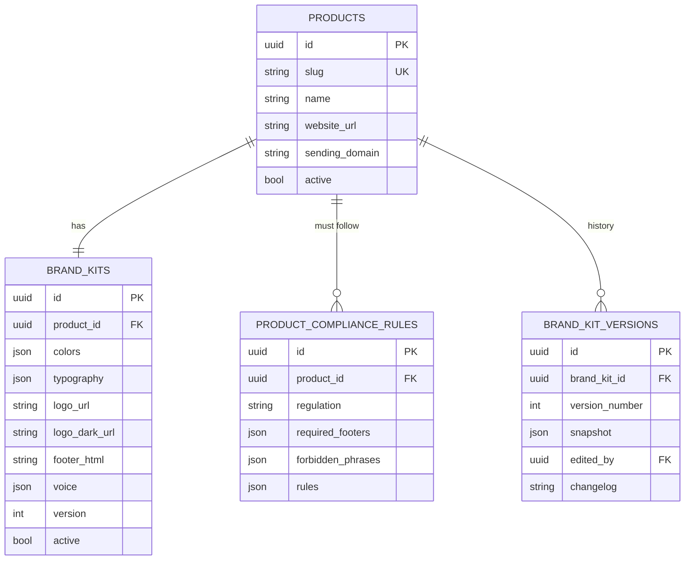

### Tables

#### `products`
- **What:** The 7 BridgingTech products (Denefits, Practina, Lendee, CoolCredit, Credee, FinanceMutual, Recuvery).
- **Why:** Foreign key target for nearly every other table. Single source of truth for product metadata.
- **How:** Seeded at install. `slug` is the URL-safe identifier (`denefits`, `credee`). `sending_domain` is the from-domain (e.g., `mail.denefits.com`).

#### `brand_kits`
- **What:** The brand identity of each product (colors, fonts, logo, tone-of-voice, footer).
- **Why:** Drives auto-theming. A single base email template + 7 brand kits = 7 distinct-looking emails.
- **How:** Auto-extracted from product website by the Brand Extraction script (Sprint 1), then manually curated. `colors` JSON example:
```json
{
  "primary": "#0066FF",
  "secondary": "#F4F7FB",
  "accent": "#00C49A",
  "text": "#1A1F36",
  "cta_bg": "#0066FF",
  "cta_text": "#FFFFFF"
}
```
  `voice` JSON example:
```json
{
  "tone": ["professional", "trustworthy"],
  "forbidden_words": ["guaranteed", "risk-free"],
  "reading_level": "grade 8"
}
```

#### `brand_kit_versions`
- **What:** History of brand kit edits.
- **Why:** Audit trail for marketing/design changes; ability to roll back.
- **How:** A trigger or service hook snapshots `brand_kits` row on every change.

#### `product_compliance_rules`
- **What:** Regulatory rules per product (HIPAA for FinanceMutual, FDCPA for Recuvery, PCI for Denefits/Credee, GDPR for EU contacts).
- **Why:** Compliance Agent uses these to validate emails before send.
- **How:** Created by legal/compliance team. `rules` JSON contains structured checks (e.g., `{"must_include": "unsubscribe_link", "max_links": 5}`).

---

## Domain 3 — Contact Hub

**Purpose:** Unify recipient data from all 7 product MySQL DBs into one queryable source.
**Key question:** *"What's Mr. Sharma's email, which product is he in, what's his lead stage, and what's our email history with him?"*

### ER Diagram

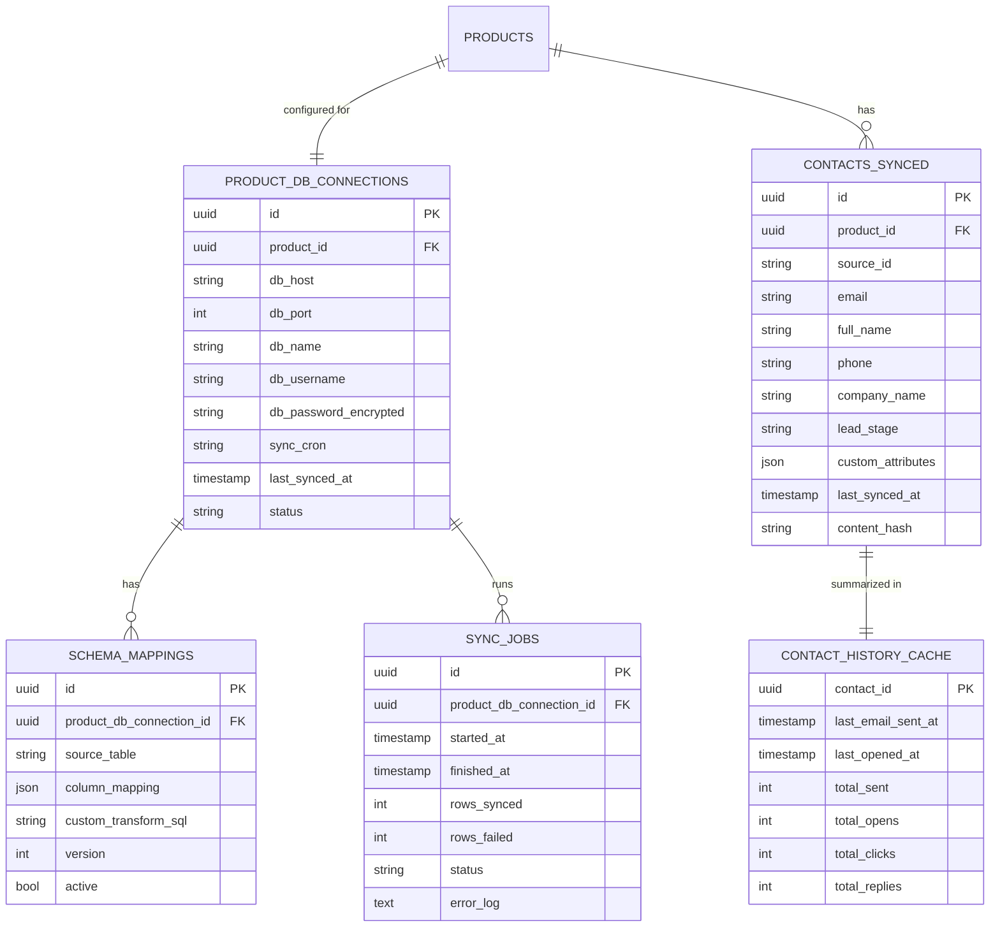

### Tables

#### `product_db_connections`
- **What:** Connection details for each of the 7 product MySQL DBs (read-only credentials).
- **Why:** System needs to physically connect to product DBs to sync contacts.
- **How:** Admin configures once per product. `db_password_encrypted` is AES-256-GCM. `sync_cron` = "0 * * * *" (hourly).

#### `schema_mappings`
- **What:** Per-product mapping of "product DB columns → unified contact schema". This is the **adapter pattern**.
- **Why:** Each product DB has different schemas — this translates them to a common format.
- **How:** `column_mapping` JSON example for Denefits:
```json
{
  "source_id":     "merchants.id",
  "email":         "merchants.contact_email",
  "full_name":     "merchants.business_name",
  "phone":         "merchants.phone",
  "company_name":  "merchants.business_name",
  "lead_stage":    "merchants.funnel_stage"
}
```
Sync service runs `SELECT col1, col2 FROM source_table` and upserts into `contacts_synced`.

#### `sync_jobs`
- **What:** Log of each sync execution.
- **Why:** Observability — "when did the last Denefits sync run, did it fail, how many rows?".
- **How:** New row per sync run. Status ∈ {`running`, `success`, `failed`}.

#### `contacts_synced`
- **What:** The unified contact records — one row per (product, source_id).
- **Why:** Single table to query when composing an email. Brand kit + contact = ready to generate.
- **How:** Sync job upserts based on `(product_id, source_id)`. `content_hash` detects changes to skip re-embedding.

#### `contact_history_cache`
- **What:** Pre-computed engagement summary per contact.
- **Why:** Avoid expensive `COUNT(*)` queries every time you compose an email.
- **How:** Updated by event processor whenever a new `email_events` row arrives.

---

## Domain 4 — Templates

**Purpose:** Reusable email templates, versioned, with performance tracking.
**Key question:** *"What templates exist for Denefits, ranked by performance, that fit a 'payment reminder' intent?"*

### ER Diagram

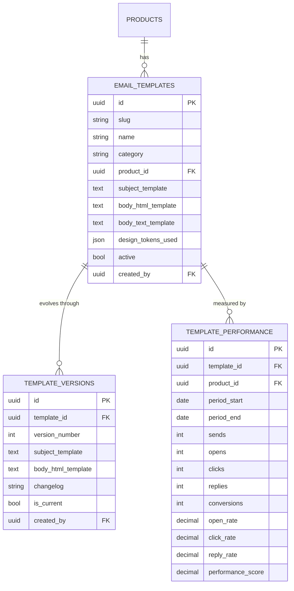

### Tables

#### `email_templates`
- **What:** Reusable templates — "welcome", "follow-up", "payment reminder", "demo invite", etc.
- **Why:** Don't reinvent the wheel for every email. Consistent voice. Performance learning.
- **How:** Subject/body use Handlebars syntax: `Hi {{contact.first_name}}, regarding {{intent.topic}}...`. Design tokens `{{brand.colors.primary}}` are filled at render time.

#### `template_versions`
- **What:** Version history of a template.
- **Why:** Edit safely — if v3 underperforms v2, roll back.
- **How:** Save creates a new version, sets old version `is_current = FALSE`.

#### `template_performance`
- **What:** Aggregated per-template metrics over time periods.
- **Why:** Powers the Template Selection Agent's ranking (pick best-performing template that fits intent).
- **How:** Rolled up daily by analytics job. `performance_score` = weighted blend (e.g., `0.3 * open_rate + 0.4 * click_rate + 0.3 * reply_rate`).

---

## Domain 5 — Conversations & Drafts

**Purpose:** Capture the AI chat sessions and the drafts they produce.
**Key question:** *"What did the user ask, what did the AI generate, what version is current, and what was the cost?"*

### ER Diagram

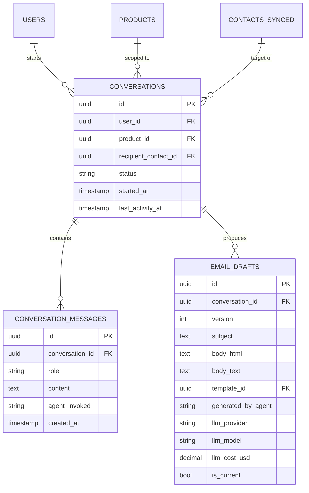

### Tables

#### `conversations`
- **What:** A chat session between a user and the AI.
- **Why:** Multi-turn refinement requires context: "make it shorter" needs to know what "it" is.
- **How:** Created when user opens new chat. `status` ∈ {`active`, `sent`, `abandoned`}.

#### `conversation_messages`
- **What:** Individual messages in the conversation (user prompts + AI responses).
- **Why:** Preserves chat history for context window assembly and audit.
- **How:** Append-only. `role` ∈ {`user`, `assistant`, `system`}. `agent_invoked` records which agent generated assistant replies.

#### `email_drafts`
- **What:** AI-generated email drafts within a conversation.
- **Why:** Every "rewrite", "make shorter", "change tone" creates a new draft — needed to compare and revert.
- **How:** New row per generation. Latest draft has `is_current = TRUE`. Cost is tracked per draft for billing/reporting.

---

## Domain 6 — Campaigns & Segments

**Purpose:** Bulk email campaigns to filtered audience segments.
**Key question:** *"Send the Q4 product update to all Registered users of Denefits who haven't engaged in 30 days."*

### ER Diagram

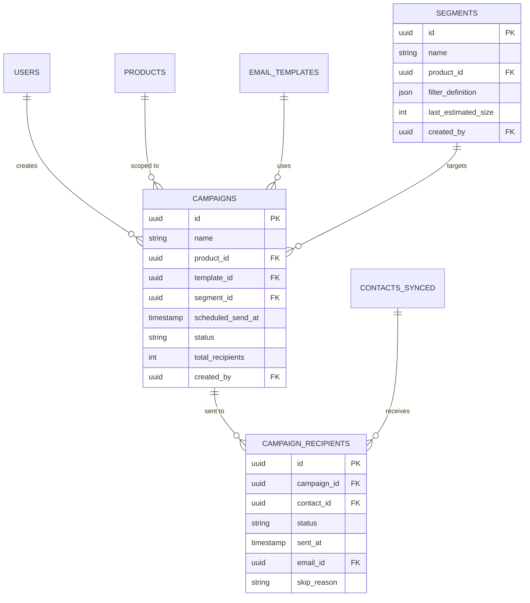

### Tables

#### `campaigns`
- **What:** Bulk send job — one template, one segment, scheduled at a time.
- **Why:** Marketing team needs to send to thousands of contacts at once.
- **How:** Created via campaign builder UI. `status` ∈ {`draft`, `scheduled`, `sending`, `sent`, `cancelled`, `failed`}. Worker picks up `scheduled` campaigns at `scheduled_send_at`.

#### `segments`
- **What:** Saved recipient filter definitions.
- **Why:** Reusable — "L2 leads in Denefits from last 30 days" can be saved and reused.
- **How:** `filter_definition` JSON:
```json
{
  "product_id": "denefits",
  "lead_stage": ["L2", "L3"],
  "created_after": "2025-09-01",
  "last_email_opened_within_days": 30,
  "exclude_unsubscribed": true
}
```
Translated to SQL by Segment Resolver service.

#### `campaign_recipients`
- **What:** Per-recipient row for each campaign — who got the email, when, what was the outcome.
- **Why:** Critical for tracking — "we sent campaign X to 10,000 people; 9,873 actually got sent, 127 were skipped because of bounce history".
- **How:** Populated when campaign starts. `skip_reason` ∈ {`unsubscribed`, `bounced_previously`, `missing_email`, `compliance_block`}.

---

## Domain 7 — Risk & Approval

**Purpose:** Classify outgoing emails by risk and route high-risk ones to human approvers.
**Key question:** *"Is this email safe to auto-send, or does a manager need to approve it?"*

### ER Diagram

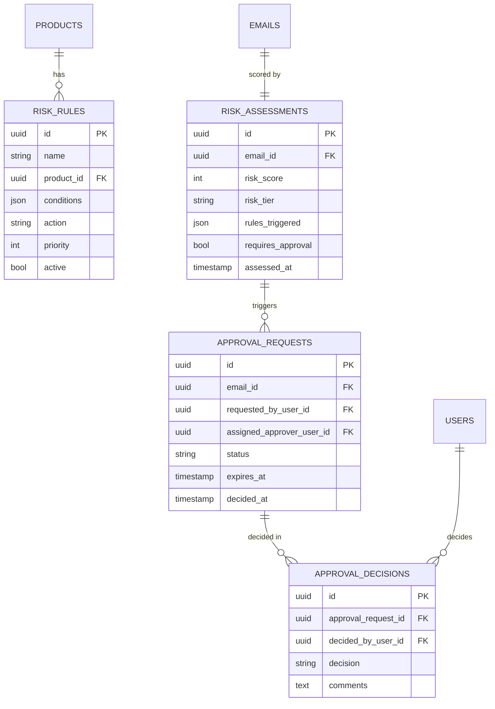

### Tables

#### `risk_rules`
- **What:** Configurable rules that classify email risk.
- **Why:** Each product has different risk profiles (healthcare email = HIGH, internal notification = LOW).
- **How:** `conditions` JSON example:
```json
{
  "any_of": [
    { "field": "recipient_count", "op": ">", "value": 1000 },
    { "field": "product_id", "op": "in", "value": ["financemutual", "recuvery"] },
    { "field": "content_contains", "op": "any", "value": ["payment due", "overdue"] }
  ]
}
```
`action` ∈ {`auto_send`, `peer_review`, `manager_approval`}. Highest-priority matching rule wins.

#### `risk_assessments`
- **What:** Risk score for a specific email.
- **Why:** Drives routing decision. Audit trail.
- **How:** Computed at send-time. `risk_score` 0-100. `risk_tier` ∈ {`low`, `medium`, `high`}.

#### `approval_requests`
- **What:** Email queued for human approval.
- **Why:** Semi-autonomous workflow — high-risk emails wait for human.
- **How:** Assigned to manager of the requester's team. `expires_at` = +24h. Slack notification sent.

#### `approval_decisions`
- **What:** The decision made on an approval request.
- **Why:** Compliance audit trail; who approved what.
- **How:** `decision` ∈ {`approved`, `rejected`, `requested_changes`}.

---

## Domain 8 — Sending

**Purpose:** The actual email delivery — what was sent, by whom, via which account.
**Key question:** *"What email was sent to Mr. Sharma yesterday, from whose Gmail, with what content?"*

### ER Diagram

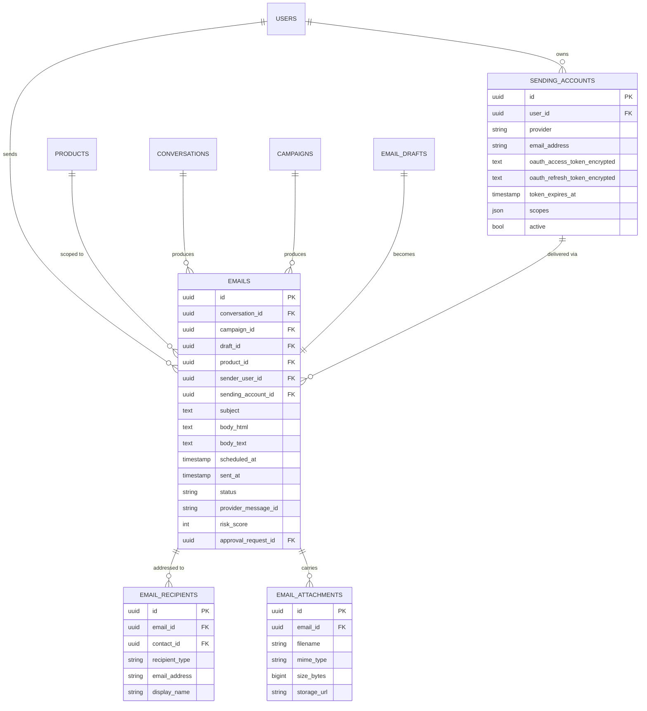

### Tables

#### `sending_accounts`
- **What:** OAuth-connected Gmail / Outlook accounts per user.
- **Why:** Emails should send from the user's *actual* mailbox so replies land in their inbox.
- **How:** User connects via OAuth on first use. Tokens encrypted at rest. Refresh handled automatically before expiry.

#### `emails`
- **What:** The central record for every email — one row per email sent.
- **Why:** Foreign key for events, attachments, recipients, risk assessment. Single source of truth.
- **How:** Created when send is initiated. `status` lifecycle: `queued → sent → delivered → opened → ...`. `provider_message_id` lets us match webhook events back.

#### `email_recipients`
- **What:** To/Cc/Bcc recipients per email.
- **Why:** Some emails have multiple recipients with different types.
- **How:** `recipient_type` ∈ {`to`, `cc`, `bcc`}. Linked to `contacts_synced` when possible; falls back to free-text email.

#### `email_attachments`
- **What:** File attachments (PDFs, proposals, etc.).
- **Why:** Sales reps need to attach proposals; support needs to attach documentation.
- **How:** Files uploaded to object storage (S3/GCS), URL stored in DB. Size limit enforced (25 MB to match Gmail).

---

## Domain 9 — Tracking & Events

**Purpose:** Capture every interaction with a sent email — opens, clicks, replies, bounces.
**Key question:** *"What happened to the email we sent? Did they open it? Click which link?"*

### ER Diagram

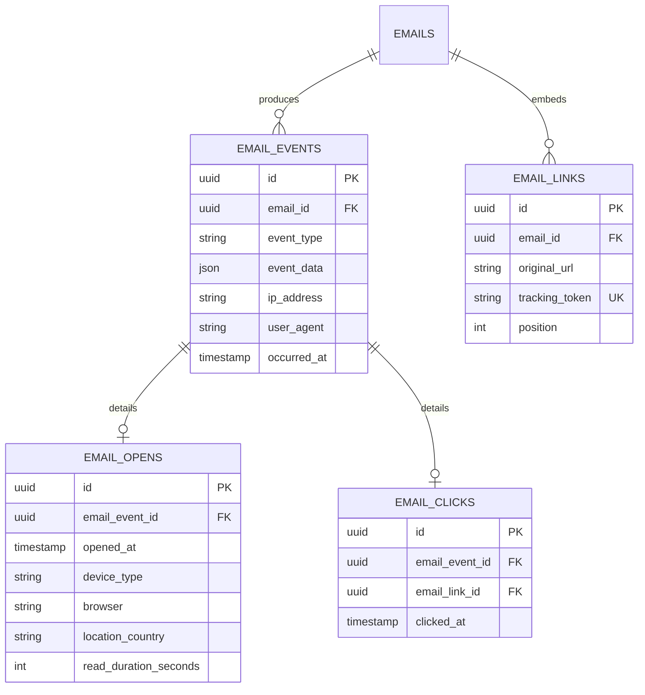

### Tables

#### `email_events`
- **What:** Every event for every email — sent, delivered, opened, clicked, replied, bounced, spam-marked, unsubscribed.
- **Why:** The raw stream that powers all analytics and the learning loop.
- **How:** High write volume — partition by `occurred_at` (monthly partitions in MySQL/PG). Captured via:
  - Provider webhooks (Gmail/Outlook bounce, delivery)
  - 1x1 tracking pixel (opens)
  - Tracking redirect URL (clicks)
  - IMAP polling on user mailbox (replies)

#### `email_opens`
- **What:** Extra details for open events.
- **Why:** Engagement quality matters — read for 30 seconds is different from a 1-second glance.
- **How:** Tracking pixel reports back; JavaScript timer measures read duration when possible.

#### `email_links`
- **What:** Each link embedded in an email, with a unique tracking token.
- **Why:** To know which link was clicked, we replace original URLs with tracking redirects.
- **How:** At render time, original URLs replaced with `https://track.bridgingtech.com/c/{tracking_token}`. Redirect server logs click and forwards.

#### `email_clicks`
- **What:** Click events with link reference.
- **Why:** Power CTR analytics per link, per template, per product.
- **How:** Click event fires on redirect, joins to `email_links` for the link metadata.

---

## Domain 10 — AI Ops, Compliance & Audit

**Purpose:** Track every AI call, every compliance check, every action — for cost, debugging, and audit.
**Key question:** *"How much did we spend on AI yesterday? Which prompts work? What did user X do last week?"*

### ER Diagram

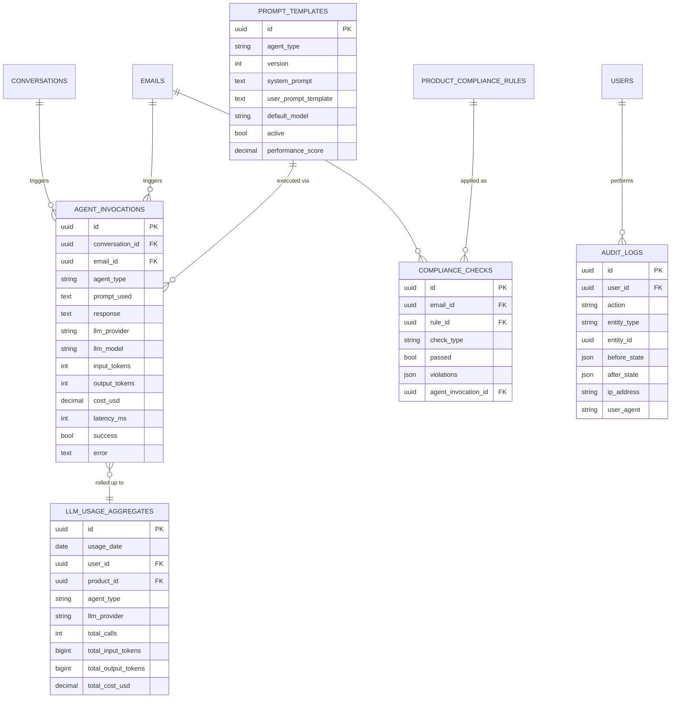

### Tables

#### `agent_invocations`
- **What:** Every LLM call logged — which agent, which model, prompt, response, cost, latency.
- **Why:** Debugging, cost tracking, prompt iteration, A/B testing.
- **How:** Logged by LLM Router (LiteLLM hook). Cost computed from token counts × per-model pricing.

#### `prompt_templates`
- **What:** Versioned prompts per agent.
- **Why:** Iterate prompts safely; A/B test; promote winners.
- **How:** Managed via Langfuse UI, synced to DB. `performance_score` from downstream metrics (reply rate, open rate).

#### `llm_usage_aggregates`
- **What:** Daily rolled-up LLM usage by (user, product, agent, provider).
- **Why:** Cost reporting without scanning the huge `agent_invocations` table.
- **How:** Daily ETL job rolls up. Powers budget alerts.

#### `compliance_checks`
- **What:** Per-email compliance check results.
- **Why:** Audit trail for HIPAA / FDCPA / PCI / GDPR. Required for legal.
- **How:** Compliance Agent runs all relevant rules; each check is one row. `violations` JSON lists what failed.

#### `audit_logs`
- **What:** Audit trail of all significant actions (login, send, approve, edit brand kit, change risk rule).
- **Why:** Security, compliance, debugging ("who changed Denefits' brand color?").
- **How:** Captured via middleware/decorator on mutating endpoints. `before_state` / `after_state` diff stored as JSON.

---

## Cross-Domain Relationships

The diagram below shows how the 10 domains connect at the top level (only the most important FKs across domains):

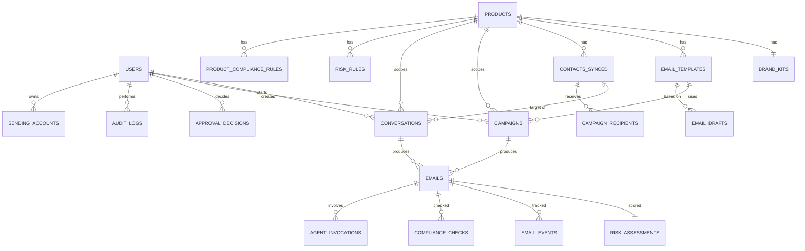

**Reading guide:** `USERS` and `PRODUCTS` are the two most-connected entities — almost everything traces back to one of them. `EMAILS` is the operational hub — once an email is created, many other tables hang off of it.

---

## Indexing & Performance Notes

### High-volume tables (need partitioning + indexes)
- `email_events` — partition by month on `occurred_at`. Indexes: `(email_id)`, `(event_type, occurred_at)`.
- `agent_invocations` — partition by month. Indexes: `(agent_type, invoked_at)`, `(llm_provider, invoked_at)`.
- `audit_logs` — partition by month. Indexes: `(user_id, occurred_at)`, `(entity_type, entity_id)`.

### Lookup-heavy tables (need covering indexes)
- `contacts_synced` — `(product_id, email)`, `(product_id, lead_stage)`.
- `emails` — `(sender_user_id, sent_at)`, `(product_id, sent_at)`.
- `campaign_recipients` — `(campaign_id, status)`.

### Recommended row-count targets (1-year horizon)
| Table | Estimated rows |
|---|---|
| users | < 1,000 |
| contacts_synced | 1M–10M |
| emails | 5M–50M |
| email_events | 50M–500M |
| agent_invocations | 20M–200M |
| audit_logs | 10M–100M |

For 50M+ row tables, consider archival to cold storage (S3/Parquet) after 12 months.

---

## Setup Order

When building from scratch, set up tables in this order to satisfy foreign keys:

1. **Foundation** → `roles`, `products`, `users`, `teams`, `user_teams`, `user_roles`, `product_team_access`
2. **Brand** → `brand_kits`, `brand_kit_versions`, `product_compliance_rules`
3. **Integration** → `product_db_connections`, `schema_mappings`
4. **Contacts** → `contacts_synced`, `contact_history_cache`, `sync_jobs`
5. **Templates** → `email_templates`, `template_versions`
6. **Conversation** → `conversations`, `conversation_messages`, `email_drafts`
7. **Campaigns** → `segments`, `campaigns`, `campaign_recipients`
8. **Risk** → `risk_rules`, `risk_assessments`, `approval_requests`, `approval_decisions`
9. **Sending** → `sending_accounts`, `emails`, `email_recipients`, `email_attachments`, `email_links`
10. **Tracking** → `email_events`, `email_opens`, `email_clicks`
11. **AI Ops** → `prompt_templates`, `agent_invocations`, `llm_usage_aggregates`
12. **Compliance & Audit** → `compliance_checks`, `audit_logs`
13. **Aggregates** → `template_performance` (populated after first sends)

---

*Document version: 1.0 — Generated for BridgingTech Email Platform v1 MVP scope.*
*Next document recommended: SQL DDL file with full CREATE TABLE statements.*
